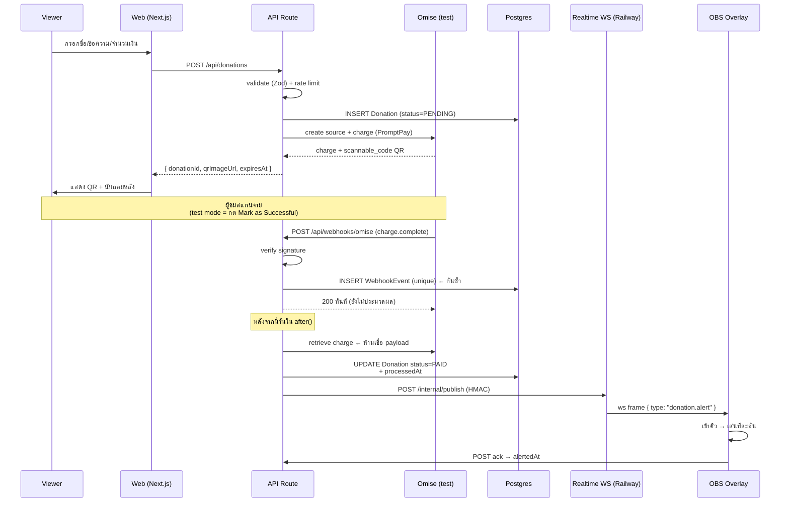

# DESIGN — Donation Platform for Streamers

> **ชื่อโปรเจกต์:** `DONATR` (โฟลเดอร์/repo ยังชื่อ `donate-platform`)
> **สถานะ:** M0, M1, M3 เสร็จแล้ว — ต่อไปคือ **M2a** (WS server + ticket + rooms)
> **วันที่:** เขียน 2026-07-27 · แก้ล่าสุด 2026-08-01 (ดู changelog ข้อ 16)
> **อ้างอิงต้นแบบ:** [hiwdo.com](https://hiwdo.com/) (Next.js เหมือนกัน)

---

## 0. คำเตือนสำคัญที่ต้องอ่านก่อน

โปรเจกต์นี้ออกแบบเป็น **portfolio / demo เท่านั้น — ไม่รับเงินจริง**

เหตุผล:

1. รับเงินคนอื่นแล้วจ่ายออกให้บุคคลที่สาม เข้าข่าย **e-money / payment facilitator** ที่ ธปท. กำกับ
2. Payment gateway ในไทย (Omise/Opn, GB Prime Pay, 2C2P) เปิด **live mode** ให้เฉพาะนิติบุคคลที่ผ่าน KYC
3. Payout API (Omise Transfer/Recipient) ต้องมี KYC เช่นกัน

**ข้อบังคับที่ต้องทำจริง:**

- README + banner บนหน้าเว็บต้องเขียนชัดว่า **"DEMO — ไม่รับเงินจริง (sandbox mode)"**
- ห้ามมีข้อความใดทำให้เข้าใจผิดว่าโอนเงินได้จริง
- ห้ามใส่ตัวเลขสถิติปลอม (เช่น "ยอดโดเนทรวม 5 ล้านบาท") — ให้ใช้ข้อมูล seed ที่ระบุว่าเป็น demo

---

## 1. เป้าหมาย

### 1.1 เป้าหมายทางธุรกิจ (สมมติ)
แพลตฟอร์มให้สตรีมเมอร์รับโดเนทจากผู้ชม พร้อม alert เด้งบนหน้าจอสตรีมแบบเรียลไทม์

### 1.2 เป้าหมายจริงของโปรเจกต์นี้
เป็นชิ้นงานพอร์ตที่**โชว์ทักษะที่ taskboard ยังไม่มี**:

| ทักษะ | taskboard มีไหม | โปรเจกต์นี้ |
|---|---|---|
| CRUD + auth + RBAC | ✅ มีแล้ว | มี (ซ้ำ) |
| Drag & drop / animation | ✅ มีแล้ว | ไม่เน้น |
| **Real-time push** | ❌ ไม่มีเลย | ✅ **จุดขายหลัก** |
| **Payment integration + webhook** | ❌ | ✅ **จุดขายหลัก** |
| **Idempotency / race condition** | ❌ | ✅ |
| **Threat modeling / abuse prevention** | บางส่วน | ✅ |
| Multi-tenant (หลาย streamer) | ❌ | ✅ |

> ถ้าตัด 4 ข้อล่างออก โปรเจกต์นี้จะกลายเป็น CRUD ธรรมดาที่ซ้ำกับ taskboard — **ไม่คุ้มเวลา**

---

## 2. ขอบเขต (Scope)

### 2.1 MVP — ต้องมี

- สมัคร/ล็อกอินสำหรับสตรีมเมอร์ (NextAuth)
- หน้าโดเนทสาธารณะ `/{slug}` — ผู้ชมกรอกชื่อ + ข้อความ + จำนวนเงิน
- สร้าง PromptPay QR ผ่าน Omise **test mode**
- รับ webhook `charge.complete` → บันทึกโดเนท
- **Overlay page สำหรับ OBS** — alert เด้งเรียลไทม์ พร้อมคิว
- Dashboard: ประวัติโดเนท + ยอดรวม + กราฟ
- ตั้งค่า alert: เสียง, ระยะเวลา, ข้อความ template
- **Demo mode**: ปุ่ม "จำลองโดเนท" สำหรับ demo ตอนสัมภาษณ์

### 2.2 Phase 2 — ถ้ามีเวลา

- Slip verification adapter (SlipOK) — ดูหัวข้อ 7.3
- TTS อ่านข้อความโดเนท
- Goal bar / leaderboard overlay
- แพ็กเกจ Basic/Pro (จำลอง ไม่เก็บเงินจริง)

### 2.3 ไม่ทำแน่นอน (Non-goals)

- ❌ รับเงินจริง / live mode
- ❌ Payout เข้าบัญชีจริง (จำลองสถานะเท่านั้น)
- ❌ มือถือแอป
- ❌ ระบบแชท
- ❌ i18n (ไทยอย่างเดียวพอ)

---

## 3. ผู้ใช้ (Actors)

| Actor | ทำอะไรได้ | Auth |
|---|---|---|
| **Viewer (ผู้โดเนท)** | ดูหน้าโดเนท, ส่งโดเนท | ไม่ต้องล็อกอิน |
| **Streamer** | จัดการโปรไฟล์, ดูโดเนท, ตั้งค่า alert, ขอ overlay URL | NextAuth (credentials + OAuth) |
| **Admin** | ดูทุกโดเนท, ระงับบัญชี, ดู audit log | NextAuth + role check |
| **OBS Overlay** | รับ alert อย่างเดียว (read-only) | **Overlay token** (ไม่ใช่ session) |

> **จุดสำคัญ:** Overlay ไม่ใช่ user มันเป็น browser source ใน OBS ที่ไม่มี cookie/session
> ต้อง auth ด้วย token ใน URL → ดูหัวข้อ 8.3

---

## 4. User Flows

### 4.1 Flow โดเนท (เส้นทางหลัก)



### 4.2 Flow ตั้งค่า Overlay

1. Streamer ล็อกอิน → Dashboard → หน้า "Overlay"
2. ระบบสร้าง/แสดง URL: `https://.../overlay/{overlayToken}`
3. ปุ่ม **Copy** + คำเตือนตัวแดง: *"อย่าเปิด URL นี้ให้เห็นบนสตรีม"*
4. ปุ่ม **Rotate token** — เผลอโชว์แล้วกดเปลี่ยนได้ทันที
5. ปุ่ม **Test alert** — ยิง alert ปลอมไปทดสอบว่าตั้งใน OBS ถูก

### 4.3 Flow Demo (สำหรับสัมภาษณ์)

> **ตรวจสอบแล้ว 2026-07-27 — ข้อจำกัดจริงที่ต้องออกแบบหลบ:**
> **Omise ไม่มี public API สำหรับ "Mark as Successful"** เอกสาร `api-testing` ระบุว่าเป็น
> ปุ่ม **Actions** บน dashboard เท่านั้น ไม่มีวิธีเรียกแบบ programmatic
> → ดีไซน์รอบแรกที่ให้ปุ่มเดโม่ไปสั่ง Omise **ทำไม่ได้ ต้องเปลี่ยน**

**ดีไซน์ใหม่: ปุ่มเดโม่เดินผ่าน `MockProvider` ไม่ใช่ Omise**

```
กด "จำลองการจ่ายเงิน"
  → POST /api/demo/complete-donation { donationId }
  → MockProvider สร้าง synthetic event แล้ว POST เข้า /api/webhooks/omise ของตัวเอง
     (เซ็นด้วย MOCK_WEBHOOK_SECRET — คนละตัวกับ secret ของ Omise จริง)
  → เดินผ่าน pipeline จริงครบทุกขั้น:
     verify signature → INSERT WebhookEvent → 200 → after() → retrieve (mock) → PAID → publish → alert เด้ง
```

**ได้อะไร:** ทุกขั้นที่สำคัญยังเป็นของจริง — signature verification, idempotency, `after()`, publish, คิว alert
สิ่งเดียวที่ถูกแทนคือ *"ใครเป็นคนบอกว่าจ่ายแล้ว"*

**กติกาความซื่อสัตย์ (ห้ามละเมิด):**
- ปุ่มต้องเขียนว่า **"จำลองการจ่ายเงิน (simulated webhook)"** ไม่ใช่ "จ่ายเงิน"
- README ต้องระบุว่า demo mode ใช้ `MockProvider` เพราะ Omise ไม่มี API สำหรับข้อนี้
- `MOCK_WEBHOOK_SECRET` ต้องคนละตัวกับของจริง และ endpoint ต้อง **404 เมื่อ `DEMO_MODE !== 'true'`**
- ตอนสัมภาษณ์ ถ้าถูกถามให้ตอบตรง ๆ ว่าจำลอง — **การอธิบายว่าทำไมถึงต้องจำลองคือคำตอบที่ดีอยู่แล้ว**

**Omise ของจริงยังต้องต่อและทดสอบ** (M3) แค่ทดสอบด้วยการกดปุ่มบน dashboard ตอน dev
เก็บคลิป/GIF ไว้ในตอนนั้นเลย จะได้มีหลักฐานว่าเส้นทาง Omise จริงก็เดินได้

---

## 5. สถาปัตยกรรม

```mermaid
graph TB
    subgraph Client
        A[หน้าโดเนท /slug]
        B[Dashboard สตรีมเมอร์]
        C[Overlay /overlay/token<br/>ใน OBS Browser Source]
    end

    subgraph "apps/web — Vercel (Next.js 16)"
        D[Server Components / Pages]
        E[API Routes]
        F[/api/webhooks/omise/]
        G[/api/overlay/token/ticket<br/>ออก JWT อายุสั้น]
    end

    subgraph "apps/realtime — Railway (Node + ws)"
        M[WebSocket Server<br/>rooms: Map streamerId → Sockets]
        N[/internal/publish<br/>HMAC-protected/]
        P[/healthz/]
    end

    subgraph External
        H[(Neon Postgres<br/>+ Prisma)]
        I[Omise test mode]
        K[Upstash Redis<br/>rate limit]
        L[Cloudflare R2<br/>เสียง/รูป alert]
    end

    A --> E
    B --> D
    C -->|1. ขอ ticket| G
    C -->|2. wss?ticket=JWT| M
    E --> H
    E --> I
    E --> K
    I -.webhook.-> F
    F --> H
    F -->|3. publish| N
    N --> M
    M -->|4. push| C
    B --> L
```

### 5.1 Real-time: WebSocket server ของตัวเอง (ตัดสินใจแล้ว)

**ข้อจำกัดที่ตรวจสอบแล้ว:** Vercel Hobby จำกัด function duration ที่ **60 วินาที**
→ SSE หรือ WebSocket ที่ต้องค้างสายเป็นชั่วโมง (overlay เปิดทิ้งไว้ตลอดการสตรีม) **ทำบน Vercel ไม่ได้**

ทางเลือกที่พิจารณา:

| ทางเลือก | ข้อดี | ข้อเสีย | ตัดสิน |
|---|---|---|---|
| SSE บน Vercel | ไม่มี dependency | **ตายที่ 60 วิ** | ❌ |
| Pusher / Ably (managed) | ไม่ต้องดูแล server, reconnect ให้ฟรี | ผูก vendor, ซ่อนส่วนที่น่าสนใจที่สุดไว้หลัง SDK | ❌ |
| **WebSocket server เองบน Railway** | คุม protocol เต็ม, ได้ heartbeat/reconnect/backpressure จริง, Railway ใช้เป็นอยู่แล้วจาก taskboard | 2 deployable, ต้องเขียน reconnect เอง, scale แนวนอนต้องมี Redis adapter | ✅ **เลือกแล้ว** |

**เหตุผลที่เลือก:** อันนี้คือ*จุดขายหลัก*ของโปรเจกต์ ถ้าใช้ Pusher ส่วนที่ยากที่สุดจะถูก SDK กลืนไปหมด
คำถามสัมภาษณ์อย่าง *"reconnect ยังไง"* / *"รู้ได้ไงว่า client ตายแล้ว"* / *"scale ยังไง"* จะตอบไม่ได้ถ้าไม่เคยเขียนเอง

**ต้นทุนที่ยอมรับ:** deploy 2 ที่, ต้องเขียน heartbeat/backoff เอง, และ **in-memory rooms ทำให้ scale ได้แค่ 1 instance** (ดู 8.6 — ข้อจำกัดนี้ต้องเขียนใน README ไม่ใช่ซ่อน)

**เลือก `ws` ไม่ใช่ `socket.io`** — `socket.io` แถม reconnect/heartbeat มาให้ ซึ่งดีสำหรับงานจริง
แต่โปรเจกต์นี้ต้องการ*โชว์*ว่าเขียนสองอย่างนั้นเองได้ `ws` เป็น WebSocket ดิบตาม RFC 6455 เบากว่าและไม่ซ่อนอะไร

### 5.1.1 โครงสร้าง Monorepo

```
donate-platform/
├── apps/
│   ├── web/          → Next.js 16 (deploy: Vercel, root dir = apps/web)
│   └── realtime/     → Node + ws  (deploy: Railway, root dir = apps/realtime)
├── packages/
│   └── shared/       → type ของ AlertPayload, Zod schema, helper JWT
├── pnpm-workspace.yaml
└── DESIGN.md
```

`packages/shared` สำคัญ: `AlertPayload` ต้องเป็น type เดียวกันทั้งฝั่ง publisher (Next.js) และ
consumer (overlay) — ถ้าแยก repo แล้ว copy type ไปมา วันหนึ่งจะไม่ตรงกันแน่นอน

### 5.1.2 ต้นทุน hosting (ตรวจสอบแล้ว 2026-07-27)

| | แผน | ค่าใช้จ่าย |
|---|---|---|
| `apps/web` | Vercel Hobby | **ฟรี** (non-commercial, ไม่มีวันหมดอายุ) |
| `apps/realtime` | **Railway Hobby** | **$5/เดือน และ$5 นั้นเป็นเครดิตใช้งานในตัว** |

Railway **ไม่มี free tier ถาวรแล้ว** มีแค่เครดิตทดลอง $5 ครั้งเดียว (ไม่ต้องใช้บัตร)

อัตราจริง: RAM ~**$10/GB-เดือน**, CPU ~**$20/vCPU-เดือน** (คิดจาก $0.00000386/GB/วินาที และ $0.00000772/vCPU/วินาที)

**ประเมินของเรา:** Node + `ws` เปล่า ๆ กิน ~150 MB, CPU แทบนิ่ง (heartbeat ทุก 30 วิ กับ socket ไม่กี่ตัว)
→ RAM ~$1.5 + CPU ~$0.4 + egress แทบเป็นศูนย์ = **~$2/เดือน อยู่ในเครดิต $5 สบาย**

> **การตัดสินใจไม่ให้ `realtime` ต่อ Prisma (หัวข้อ 8.3) ประหยัดเงินด้วย** — Prisma client กิน RAM
> เพิ่มอีก 200–300 MB ซึ่งจะดันค่าใช้จ่ายทะลุเครดิตทันที ดีไซน์ที่ปลอดภัยกว่าบังเอิญถูกกว่าด้วย

**อย่าเปิด app sleeping** ถ้า Railway เสนอมา — WS server ที่หลับ = overlay ตายกลางสตรีม
ด้วยเหตุผลเดียวกัน **Render free tier ใช้ไม่ได้** เพราะ spin down เมื่อไม่มีทราฟฟิก

### 5.1.3 ความเสี่ยง stack ที่เคลียร์แล้ว

**NextAuth v4 + Next.js 16 เข้ากันได้ไหม?** — **ได้ ยืนยันจากโค้ดของคุณเอง ไม่ใช่การเดา**
`taskboard/package.json` รันอยู่บน `next 16.2.6` + `next-auth ^4.24.14` + `react 19.2.4`
CI เขียวและ deploy จริงอยู่ → ไม่ต้องเสี่ยงย้ายไป Auth.js v5 กลางทาง

> ถ้าเจอปัญหาจริงตอน M0 ให้ก๊อป config จาก taskboard มาก่อน อย่าเริ่มจากศูนย์

### 5.2 Tech Stack

| ชั้น | เลือก | เหตุผล |
|---|---|---|
| Framework | Next.js 16 App Router | สแตกที่ถนัดอยู่แล้ว, ต้นแบบก็ใช้ |
| ภาษา | TypeScript (strict) | — |
| UI | Tailwind v4 + Framer Motion | reuse จากพอร์ต |
| DB | Neon Postgres + Prisma | เหมือน taskboard |
| Auth | NextAuth v4 | เหมือน taskboard |
| Validation | **Zod v4 (shared client/server)** | reuse pattern จาก contact form ในพอร์ต |
| Payment | **Omise/Opn test mode** | sandbox ฟรี ไม่ต้องจดบริษัท, โค้ดเหมือน live 100% |
| **Real-time** | **Node + `ws` (RFC 6455)** | ดูหัวข้อ 5.1 — เขียนเอง ไม่ใช้ managed |
| Ticket auth | `jose` (JWT HS256) | JWT อายุสั้นสำหรับเปิด socket — ดู 8.3 |
| Monorepo | pnpm workspaces | แชร์ type ระหว่าง web กับ realtime |
| Rate limit | Upstash Redis | reuse `lib/rate-limit.ts` จากพอร์ตได้เลย |
| Storage | Cloudflare R2 | reuse pattern presigned URL จาก taskboard |
| Test | Vitest | เหมือน taskboard |
| CI | GitHub Actions | เหมือน taskboard |
| Deploy | Vercel (`web`) + **Railway (`realtime`)** | Railway เคย deploy แล้วจาก taskboard |

> **ไม่มีภาษาใหม่ที่ต้องเรียนเลย** ของใหม่คือ *แนวคิด* (real-time, payment webhook, idempotency) ไม่ใช่ syntax

---

## 6. Data Model

### 6.1 หลักการเรื่องเงิน

> **เก็บเงินเป็น `Int` หน่วยสตางค์เสมอ ห้ามใช้ `Float`**
>
> `0.1 + 0.2 !== 0.3` ใน floating point — เงินหายจริง Omise เองก็ใช้หน่วยย่อย (สตางค์)
> 100 บาท = `10000`

### 6.2 Prisma Schema (ร่าง)

```prisma
// ---------- ผู้ใช้ ----------
model User {
  id            String   @id @default(cuid())
  email         String   @unique
  passwordHash  String?
  role          Role     @default(STREAMER)
  createdAt     DateTime @default(now())

  streamer      Streamer?
  @@index([email])
}

enum Role { STREAMER ADMIN }

// ---------- โปรไฟล์สตรีมเมอร์ ----------
model Streamer {
  id            String   @id @default(cuid())
  userId        String   @unique
  user          User     @relation(fields: [userId], references: [id], onDelete: Cascade)

  slug          String   @unique          // URL: /{slug}
  displayName   String
  bio           String?
  avatarUrl     String?
  isActive      Boolean  @default(true)
  isSuspended   Boolean  @default(false)

  minAmount     Int      @default(2000)   // 20.00 บาท (สตางค์)
  maxAmount     Int      @default(10000000)

  overlayToken  String   @unique @default(cuid())  // ใช้ใน OBS URL
  tokenRotatedAt DateTime @default(now())

  alertSetting  AlertSetting?
  donations     Donation[]
  payouts       Payout[]

  createdAt     DateTime @default(now())
  @@index([slug])
}

// ---------- ตั้งค่า alert ----------
model AlertSetting {
  id             String   @id @default(cuid())
  streamerId     String   @unique
  streamer       Streamer @relation(fields: [streamerId], references: [id], onDelete: Cascade)

  template       String   @default("{name} โดเนท {amount} บาท")
  durationMs     Int      @default(6000)
  soundUrl       String?
  imageUrl       String?
  ttsEnabled     Boolean  @default(false)
  minAlertAmount Int      @default(2000)   // ต่ำกว่านี้ไม่เด้ง alert
  profanityFilter Boolean @default(true)
}

// ---------- โดเนท ----------
model Donation {
  id            String         @id @default(cuid())
  streamerId    String
  streamer      Streamer       @relation(fields: [streamerId], references: [id])

  donorName     String         @db.VarChar(40)
  message       String         @db.VarChar(200)
  amount        Int                              // สตางค์
  currency      String         @default("THB")

  status        DonationStatus @default(PENDING)
  provider      PaymentProvider
  providerRef   String?                          // omise charge id
  slipTransRef  String?                          // จาก slip verification

  moderation    ModerationStatus @default(CLEAN)
  alertedAt     DateTime?                        // เด้ง alert ไปแล้วหรือยัง

  createdAt     DateTime       @default(now())
  paidAt        DateTime?
  expiresAt     DateTime

  // กันซ้ำระดับฐานข้อมูล ไม่ใช่ระดับโค้ด
  @@unique([provider, providerRef])
  @@unique([slipTransRef])
  @@index([streamerId, createdAt])          // หน้าประวัติใน dashboard
  @@index([status, expiresAt])              // job กวาดของหมดอายุ
  // index สำหรับ /missed อยู่ใน migration เขียนมือ — ดู 6.2.1
}

enum DonationStatus   { PENDING PAID FAILED EXPIRED REFUNDED }
enum PaymentProvider  { OMISE SLIP MOCK }
enum ModerationStatus { CLEAN FLAGGED HIDDEN }

// ---------- ตารางกัน webhook ซ้ำ (สำคัญมาก) ----------
model WebhookEvent {
  id          String   @id                  // ใช้ event id ของ provider ตรง ๆ
  provider    String
  eventType   String
  payload     Json
  receivedAt  DateTime @default(now())
  processedAt DateTime?                     // NULL = ยังไม่เสร็จ → reconciler เก็บ (ดู 7.4)
  attempts    Int      @default(0)
  lastError   String?

  @@index([provider, receivedAt])
  @@index([processedAt, attempts])          // ให้ reconciler หาแถวค้างได้เร็ว
}

// ---------- payout (จำลองเท่านั้น) ----------
model Payout {
  id          String   @id @default(cuid())
  streamerId  String
  streamer    Streamer @relation(fields: [streamerId], references: [id])
  amount      Int
  status      String   @default("SIMULATED")  // ไม่มีเงินจริง
  note        String   @default("DEMO — no real funds transferred")
  createdAt   DateTime @default(now())
}
```

### 6.2.1 Partial index สำหรับ `/missed` (ต้องเขียน migration เอง)

query ที่ถูกยิงบ่อยที่สุดในระบบคือ missed-alerts — โดน**ทุกครั้งที่ overlay ต่อ/reconnect**:

```sql
SELECT * FROM "Donation"
WHERE "streamerId" = $1 AND status = 'PAID' AND "alertedAt" IS NULL;
```

index ที่ประกาศไว้ข้างบน **ไม่ช่วยเลยสักอัน** — `[streamerId, createdAt]` ไม่มี `status`/`alertedAt`
ส่วน `[status, expiresAt]` ขึ้นต้นผิดคอลัมน์ ผลคือ Postgres ต้องอ่านโดเนท**ทั้งหมด**ของสตรีมเมอร์คนนั้น
สตรีมเมอร์ที่มีโดเนทสะสมเป็นหมื่นแถว = เน็ตกระตุกทีนึงคือ full scan ทีนึง

```sql
-- prisma/migrations/xxxx_missed_alerts_index/migration.sql
CREATE INDEX "Donation_pending_alert_idx"
  ON "Donation" ("streamerId")
  WHERE status = 'PAID' AND "alertedAt" IS NULL;
```

**ทำไมต้อง partial ไม่ใช่ composite ธรรมดา:** แถวจะหลุดออกจาก index ทันทีที่ `ack` set `alertedAt`
→ index นี้จะมีขนาด**แค่จำนวน alert ที่ยังไม่เด้ง** (ปกติ 0–5 แถว) ไม่ว่าตารางหลักจะโตแค่ไหน

**⚠️ ข้ออ้าง "0–5 แถว" ข้างบนจะเป็นจริงก็ต่อเมื่อ *ทุกแถวที่เข้า index มีทางออก* — และดีไซน์รอบก่อนมีแถวที่ไม่มีทางออก**

`AlertSetting.minAlertAmount` บอกว่าโดเนทที่ต่ำกว่าเกณฑ์ "บันทึกแต่ไม่เด้ง alert" แต่ query ของ `/missed`
(8.4) กรองแค่ `status='PAID' AND alertedAt IS NULL` ไม่รู้จักเกณฑ์นั้นเลย ผลคือโดเนทต่ำกว่าเกณฑ์จะ
**ไม่ถูก alert → ไม่ถูก ack → `alertedAt` เป็น NULL ตลอดกาล** มันจะกองอยู่ใน partial index ไม่มีวันหลุด
และ overlay จะดึงมันกลับมาทั้งกองทุกครั้งที่ reconnect

**กติกา:** `alertedAt` แปลว่า **"จัดการเรื่องการเด้งของแถวนี้จบแล้ว"** ไม่ใช่ "เด้งไปแล้ว"
ตอน `processWebhookEvent` ถ้า `amount < streamer.alertSetting.minAlertAmount`
→ **set `alertedAt` ทันทีในทรานแซกชันเดียวกับที่ set `PAID`** แล้วไม่ต้อง publish

ทำแบบนี้แทนที่จะไปเติมเงื่อนไขยอดใน query `/missed` เพราะสองเหตุผล: เกณฑ์แก้ได้ตลอดเวลา
(ถ้ากรองตอน query โดเนทเก่าจะโผล่มาเด้งย้อนหลังทันทีที่สตรีมเมอร์ลดเกณฑ์ลง) และเงื่อนไข
`WHERE` ของ partial index ต้องเป็นค่าคงที่ ไม่มีทางอ้างอิงค่าใน `AlertSetting` ได้อยู่แล้ว

> ตอนนี้ค่า default ของ `Streamer.minAmount` กับ `AlertSetting.minAlertAmount` เท่ากันพอดี (2000 สตางค์)
> ปัญหานี้จึงยังไม่โผล่ — มันจะโผล่วันที่สตรีมเมอร์คนแรกลด `minAmount` ลงเหลือ 10 บาท

> **ข้อจำกัด Prisma:** schema ของ Prisma ยังประกาศ partial index ไม่ได้ ต้อง `prisma migrate dev --create-only`
> แล้วเติม SQL เองในไฟล์ migration — และ**อย่าลืมว่า `prisma db push` จะไม่พามันไปด้วย**

### 6.3 State machine ของ Donation

```
                 ┌──────────────► EXPIRED  (เลย expiresAt — sweeper, ดูข้างล่าง)
                 │
  PENDING ───────┼──────────────► PAID ─────► alertedAt ถูก set (เด้งแล้ว หรือต่ำกว่าเกณฑ์)
                 │
                 └──────────────► FAILED
```

**กติกา:**
- เปลี่ยนสถานะได้ทางเดียว: จาก `PENDING` เท่านั้น
- `PAID` แล้วห้ามกลับ (webhook ซ้ำต้องไม่ทำอะไร)
- ใช้ `UPDATE ... WHERE id = ? AND status = 'PENDING'` แล้วเช็คจำนวนแถวที่ถูกอัปเดต — ถ้าได้ 0 แปลว่ามีคนทำไปแล้ว **อย่ายิง alert ซ้ำ**

**ใครเป็นคนทำ `PENDING → EXPIRED`** (รอบก่อนเขียนว่า "cron/lazy check" ลอย ๆ ไม่มีเจ้าภาพ):

รวมเข้ากับ **reconciler cron รอบเดียวกัน** ของ 7.4 (ทุก 5 นาที) — งานที่สองของ job เดิม ไม่ใช่ job ใหม่

```sql
-- grace period อยู่ใน query ไม่ใช่แค่ในคำอธิบาย เหตุผลอยู่ย่อหน้าถัดไป
UPDATE "Donation" SET status = 'EXPIRED'
WHERE status = 'PENDING' AND "expiresAt" < now() - interval '2 minutes';
```

index `[status, expiresAt]` ที่ประกาศไว้ในสคีมามีไว้รับ query นี้โดยเฉพาะ (ก่อนหน้านี้ไม่มีใครใช้มันเลย)

**ลำดับสำคัญ: sweep expiry ต้องรัน *หลัง* reconcile webhook เสมอ** ไม่งั้นจะมีเคสที่ผู้ชมจ่ายตรงเส้น
webhook เข้ามาแล้วแต่ยังค้างใน `WebhookEvent` ที่ `processedAt IS NULL` แล้วโดน sweeper ปั๊ม `EXPIRED`
ทับไปก่อน — พอ reconciler มาถึงก็ `UPDATE ... WHERE status='PENDING'` ได้ 0 แถว **เงินเข้าแล้วแต่โดเนทกลายเป็นหมดอายุ**
(ต่อให้เรียงถูก ก็ต้องเผื่อ grace period ~2 นาทีหลัง `expiresAt` ก่อนปั๊ม `EXPIRED` — ตามที่ query ข้างบนเขียนไว้)

---

## 7. Payment Design

### 7.1 หลักการสูงสุด

> **อย่าเชื่ออะไรก็ตามที่มาจาก client — รวมถึงจำนวนเงิน**

- จำนวนเงินที่ผู้ใช้กรอก ใช้แค่ "สร้าง charge"
- ตอนยืนยันว่าจ่ายแล้ว **ต้อง retrieve charge จาก Omise มาอ่านยอดจริง** ไม่ใช่เชื่อ webhook payload
- webhook payload อาจถูกปลอมได้ → ต้อง verify signature **และ** retrieve ซ้ำ

### 7.1.1 Validation มี 2 ชั้น — Zod ชั้นเดียวไม่พอ

Zod schema เป็น **static** มันไม่รู้จัก streamer ตอน parse → ตรวจได้แค่รูปร่างข้อมูล

| ชั้น | ตรวจอะไร | ตรวจที่ไหน |
|---|---|---|
| **1. Zod (shared client/server)** | เป็นจำนวนเต็ม, > 0, ≤ เพดานระบบ, ชื่อ ≤ 40 ตัว, ข้อความ ≤ 200 ตัว | `packages/shared` |
| **2. Business rule (server เท่านั้น)** | `amount >= streamer.minAmount`, `amount <= streamer.maxAmount`, `!streamer.isSuspended`, `streamer.isActive` | หลังโหลด streamer จาก DB |

**ถ้าลืมชั้นที่ 2 = T7 (spam โดเนท 1 บาท) กันไม่อยู่จริง** เพราะ `minAmount` ในสคีมาจะไม่เคยถูกอ่านเลย

```ts
// ชั้น 2 — ทำหลังโหลด streamer เสมอ ห้ามข้าม
if (input.amount < streamer.minAmount) {
  return err(422, `ขั้นต่ำ ${baht(streamer.minAmount)} บาท`)
}
if (input.amount > streamer.maxAmount) {
  return err(422, `สูงสุด ${baht(streamer.maxAmount)} บาท`)
}
```

> ข้อความ error ต้องบอกเพดานจริงของสตรีมเมอร์คนนั้น ไม่ใช่ข้อความกลาง ๆ — ไม่งั้นผู้ชมงงว่าทำไมโดเนทไม่ได้

### 7.2 Provider Adapter Pattern

```ts
// lib/payments/types.ts
export interface PaymentProvider {
  readonly name: 'omise' | 'mock'

  createCharge(input: {
    donationId: string
    amount: number        // สตางค์
    currency: 'THB'
    expiresAt: Date
  }): Promise<{
    providerRef: string
    qrImageUrl: string
    expiresAt: Date
  }>

  /** ดึงสถานะจริงจาก provider — ห้ามเชื่อ webhook payload */
  retrieveCharge(providerRef: string): Promise<{
    status: 'pending' | 'successful' | 'failed'
    amount: number
    paidAt: Date | null
  }>

  verifyWebhookSignature(rawBody: string, headers: Headers): boolean
}
```

Implementation:
- `OmiseProvider` — ของจริง (test keys)
- `MockProvider` — ใช้ตอนรัน Vitest, ไม่ยิง network เลย

เลือกด้วย env: `PAYMENT_PROVIDER=omise|mock`

> **นี่คือจุดที่ทำให้โปรเจกต์ "โตต่อได้"** วันที่จดบริษัทแล้วเปลี่ยนแค่ key
> และตอนสัมภาษณ์อธิบายได้ว่าทำไมถึงแยก interface

### 7.3 Slip Verification (Phase 2) — และเหตุผลที่มันเป็น *ทางเลือกสำรอง*

**ข้อเท็จจริงที่ตรวจสอบจากสเปก SCB (`Extracting data from mini QR`):**

QR บนสลิปโอนเงินมีแค่ 5 ฟิลด์:

| Tag | ฟิลด์ | ค่า |
|---|---|---|
| 00 | API ID | `000001` (Verify Pay Slip API) |
| 01 | Sending bank ID | 3 หลัก เช่น `014` |
| 02 | Transaction Ref ID | ≤25 ตัว, `YYYYMMDD`+rand+traceID |
| 51 | Country Code | `TH` |
| 91 | CRC | checksum |

**ไม่มียอดเงิน ไม่มีเลขบัญชี ไม่มีชื่อ** → decode เองแบบ offline **ไม่มีทางตรวจได้**
CRC ก็ไม่ใช่ลายเซ็นดิจิทัล (ISO/IEC 13239, poly `1021`, init `FFFF` — สูตรสาธารณะ ใครก็คำนวณได้)

**สรุปเชิงออกแบบ:** การรับสลิปคือการ *เชื่อหลักฐานที่ผู้ใช้ยื่นมาเอง* ซึ่งเป็น anti-pattern
เส้นทางหลักจึงต้องเป็น gateway (ระบบเราสร้าง QR เอง + รับ webhook เอง = ไม่มีสลิปให้ปลอม)

ถ้าจะทำ slip adapter จริง ใช้ **SlipOK** (บุคคลธรรมดาสมัครผ่าน LINE ได้ มี free tier ~100 สลิป/เดือน) แล้วต้องมีครบ 6 ชั้น:

```ts
export interface SlipVerifier {
  verify(input: { payload: string } | { imageBase64: string }): Promise<{
    transRef: string
    amount: number
    senderBank: string
    receiverAccountLast4: string
    transferredAt: Date
  }>
}
```

**6 ชั้นป้องกันที่ต้องเขียนเอง (API ไม่ทำให้):**

| # | ชั้น | ป้องกันอะไร | วิธีทำ |
|---|---|---|---|
| 1 | เรียก API ยืนยันกับธนาคาร | สลิป Photoshop | อ่านยอด/บัญชีจาก API ไม่ใช่จากรูป |
| 2 | **dedupe `transRef` ด้วย DB unique constraint** | ยิงสลิปใบเดิมซ้ำ | `@@unique([slipTransRef])` + จับ `P2002` — **ห้ามใช้ SELECT-แล้ว-INSERT เพราะมี race condition** |
| 3 | เช็คบัญชีปลายทาง | เอาสลิปที่โอนให้คนอื่นมาใช้ | เทียบกับบัญชีที่สตรีมเมอร์ผูกไว้ |
| 4 | เช็คยอดตรง | จ่าย 20 อ้าง 2000 | เทียบกับ `Donation.amount` |
| 5 | เช็คเวลา ≤ 15 นาที | สลิปเก่าเอามาใช้ใหม่ | `transferredAt` vs `now()` |
| 6 | rate limit ต่อ IP/สตรีมเมอร์ | brute-force เดา transRef | reuse `lib/rate-limit.ts` |

### 7.4 Webhook processing — แยก "รับ" ออกจาก "ประมวลผล"

**ปัญหาของดีไซน์รอบแรก:** handler ทำ verify → insert → **retrieve จาก Omise** → update → **POST ไป Railway** → แล้วค่อยตอบ 200
คือมี network round-trip **2 ชั้นซ้อน** ก่อนตอบ Omise ถ้า Railway หน่วง → webhook timeout → Omise retry
(idempotency รับไว้ได้ก็จริง แต่ alert ถึงจอช้าโดยไม่จำเป็น)

**ดีไซน์ใหม่:**

```ts
// app/api/webhooks/omise/route.ts
import { after } from 'next/server'

export async function POST(req: Request) {
  const raw = await req.text()
  if (!provider.verifyWebhookSignature(raw, req.headers)) {
    return new Response('invalid signature', { status: 401 })   // ไม่แตะ DB
  }

  const event = JSON.parse(raw)

  // เขียนลง DB อย่างเดียว — PK ซ้ำ = เคยรับแล้ว จบ
  try {
    await db.webhookEvent.create({
      data: { id: event.id, provider: 'omise', eventType: event.key, payload: event },
    })
  } catch (e) {
    if (isUniqueViolation(e)) return Response.json({ received: true })  // ซ้ำ → ไม่ทำอะไร
    throw e
  }

  after(() => processWebhookEvent(event.id))   // รันหลังส่ง response แล้ว
  return Response.json({ received: true })     // ตอบเร็ว
}
```

ได้ทั้งความเร็ว และได้คำตอบสัมภาษณ์ที่ดีกว่าเดิม: *"ทำไมถึงแยก receive ออกจาก process"*

**⚠️ แต่การแก้นี้สร้างปัญหาใหม่ที่ต้องแก้พร้อมกัน — ห้ามลืม**

พอเราตอบ `200` ไปแล้ว **Omise จะไม่ retry อีก** เท่ากับเรา*แลก* retry ของ Omise มาเป็นความเร็ว
ถ้า `processWebhookEvent` พังใน `after()` (Railway ล่ม / DB timeout / process ถูกฆ่ากลางคัน)
→ **โดเนทนั้นค้างที่ `PENDING` ตลอดกาล ทั้งที่ผู้ชมจ่ายเงินไปแล้ว**

**เมื่อยกเลิก retry ของ provider ต้องสร้าง retry ของตัวเองเสมอ:**

1. `WebhookEvent.processedAt` เป็น `NULL` = ยังไม่เสร็จ (คอลัมน์นี้มีในสคีมาแล้ว — ตอนนี้ได้ใช้จริง)
2. เก็บ `attempts Int @default(0)` + `lastError String?` เพิ่ม
3. **Reconciler**: cron ทุก 5 นาที หยิบ event ที่ `processedAt IS NULL` และ `attempts < 5` มาทำใหม่
   **แก้ 2026-08-01 — ต้องให้ `apps/realtime` เป็นคนยิง ไม่ใช่ Vercel Cron:** Hobby รัน cron
   ได้วันละครั้งเท่านั้น และ expression ที่ถี่กว่านั้น **fail ตอน deploy** (ตรวจกับ Vercel docs แล้ว)
   `apps/realtime` เป็น process ค้างอยู่บน Railway อยู่แล้ว ตั้ง `setInterval` ได้ฟรี
   ส่วน cron รายวันของ Vercel เก็บไว้เป็น backstop เผื่อ realtime ล่ม —
   ทั้งสองทางเรียก `POST /api/cron/reconcile` ด้วย `Authorization: Bearer CRON_SECRET`
4. `processWebhookEvent` ต้อง **idempotent** อยู่แล้ว (`UPDATE ... WHERE status='PENDING'`) → รันซ้ำปลอดภัย
5. หน้า admin โชว์ event ที่ `attempts >= 5` = ต้องเข้าไปดูด้วยมือ
6. **cron ตัวเดียวกันนี้ทำ `PENDING → EXPIRED` ต่อในรอบเดียว** — reconcile ก่อน แล้วค่อย sweep expiry
   **ห้ามสลับลำดับ** เหตุผลอยู่ใน 6.3

> อันนี้ไม่ใช่ over-engineering — มันคือความต่างระหว่าง "ต่อ webhook เป็น" กับ "เข้าใจว่า at-least-once delivery แปลว่าอะไร"

---

## 8. Real-time Alert Design

### 8.1 Protocol

WebSocket ดิบ ส่ง JSON บรรทัดเดียวต่อ 1 frame ทุก message มี `type` เป็น discriminator

```ts
// packages/shared/src/realtime.ts

/** server → client */
export type ServerMessage =
  | { type: 'hello'; streamerId: string; serverTime: string }
  | { type: 'donation.alert'; data: AlertPayload }
  | { type: 'settings.updated'; data: AlertSettingPayload }
  | { type: 'pong'; t: number }
  | { type: 'error'; code: string; message: string }

/** client → server */
export type ClientMessage =
  | { type: 'ping'; t: number }
  | { type: 'ack'; donationId: string }

export type AlertPayload = {
  id: string            // donation id — ใช้ dedupe ฝั่ง client
  donorName: string     // sanitized มาจาก server แล้ว
  message: string       // sanitized มาจาก server แล้ว
  amount: number        // สตางค์
  createdAt: string     // ISO
}
```

**Close codes ที่ใช้เอง** (ช่วงที่ RFC 6455 กันไว้ให้แอป: 4000–4999)

| Code | ความหมาย | client ควรทำอะไร |
|---|---|---|
| `4001` | ticket ไม่ถูกต้อง / หมดอายุ / ถูกใช้ไปแล้ว | ขอ ticket ใหม่ แล้วต่อใหม่ — **แต่ถ้าขอไม่ได้ 404/401 ต้องหยุดถาวร ดู 8.5** |
| `4002` | streamer ถูกระงับ | **หยุด ห้าม retry** |
| `4003` | มี overlay ต่ออยู่ครบโควตาแล้ว → **ปฏิเสธตัวที่มาใหม่** | **หยุด ห้าม retry** แสดงข้อความบนจอว่ามี overlay อื่นเปิดอยู่ |
| `1012` | server กำลัง restart | reconnect ทันที (+jitter) |

> การแยก "อย่า retry" ออกจาก "retry ได้" สำคัญมาก — ไม่งั้น client ที่โดนปฏิเสธจะยิงวนไม่หยุด

**⚠️ กติกา 4003 เลือกทางแล้ว: ปฏิเสธตัวใหม่ ไม่ใช่เตะตัวเก่า**

ดีไซน์รอบแรกเขียนว่า "เกินโควตาแล้วปิดตัวเก่าสุด" คู่กับ "ได้ 4003 แล้ว backoff ลองใหม่" — **สองข้อนี้รวมกันเป็น loop ไม่จบ**
เปิด tab ที่ 6 → ตัวเก่าสุดโดนเตะ → มัน reconnect → ไปเตะตัวถัดไป → ทั้ง 6 ตัวผลัดกันตายตลอดเวลา

เลือก **ปฏิเสธตัวที่ต่อเข้ามาใหม่** เพราะ:
- overlay ที่**กำลังออกอากาศอยู่ไม่ควรโดนเตะ** ไม่ว่ากรณีใด
- เดาเจตนาผู้ใช้ง่ายกว่า (ตัวที่เปิดอยู่ก่อน = ตัวที่ใช้จริง)
- ไม่มี loop เพราะตัวที่ถูกปฏิเสธหยุดถาวร

ข้อยกเว้นเดียว: **rotate token** → เตะทุก socket เก่าด้วย `4001` (ตั้งใจให้เกิด)

### 8.2 คิว alert (สิ่งที่คนมักลืม)

โดเนทเข้าพร้อมกัน 5 คน → **ห้ามเด้งทับกัน 5 อัน**

```
รับ event → push เข้า queue → ถ้าไม่มีอันกำลังเล่น: shift มาเล่น
เล่นจบ (durationMs + เสียงจบ) → เล่นตัวถัดไป
```

- ใช้ `useRef<AlertPayload[]>` เก็บคิว ไม่ใช้ state (กัน re-render ทิ้งคิว)
- Framer Motion `AnimatePresence` สำหรับ enter/exit
- **dedupe ด้วย `Set<donationId>`** — reconnect + missed-alerts fetch ทำให้ได้ตัวซ้ำแน่นอน

### 8.3 ความปลอดภัยของ Overlay (สำคัญ)

**ปัญหา:** OBS Browser Source ไม่มี cookie/session → auth ได้แค่ token ใน URL
**และสตรีมเมอร์เผลอโชว์ URL บนสตรีมบ่อยมาก** (เปิด OBS settings ให้คนดูเห็น)

**ปัญหาที่สอง:** WebSocket server บน Railway จะตรวจ token ยังไง? มีสามทาง —

| ทาง | ข้อเสีย |
|---|---|
| ให้ WS server ต่อ Prisma เอง | มี 2 service ที่ own schema เดียวกัน migration จะพังตามกัน |
| WS server callback ไปถาม Next.js ทุกครั้งที่ต่อ | WS ตายถ้า Vercel ล่ม, ช้าตอน reconnect รัว ๆ |
| ✅ **JWT ticket อายุสั้น** | WS server verify signature แบบ offline ได้เลย ไม่ต้องแตะ DB |

**ออกแบบเป็น two-token:**

```
overlayToken (อายุยาว, อยู่ใน URL ที่วางใน OBS)
   └─→ ใช้โหลด "หน้า" overlay จาก Next.js เท่านั้น (Next ตรวจกับ DB)
         └─→ หน้าขอ ticket: GET /api/overlay/{token}/ticket
               └─→ ได้ JWT HS256 อายุ 60 วิ { sub: streamerId, jti }
                     └─→ ใช้เปิด socket: wss://realtime.../ws?ticket=<JWT>
                           └─→ WS server verify ด้วย REALTIME_JWT_SECRET (ไม่แตะ DB)
```

| มาตรการ | รายละเอียด |
|---|---|
| Token แยกจาก session | `overlayToken` ไม่มีสิทธิ์อ่าน/แก้ข้อมูลอะไรเลย นอกจากรับ alert |
| **Ticket อายุ 60 วิ** | ต่อให้ ticket หลุด ก็ใช้ได้แค่นาทีเดียว |
| **Ticket ใช้ได้ครั้งเดียว (`jti`)** | WS server เก็บ `Set<jti>` ใน memory (TTL 60 วิ) เจอซ้ำ → close `4001` ต้นทุนเกือบศูนย์เพราะ set ไม่มีวันโต ปิดช่อง "URL โผล่บนสตรีม แล้วมีคนก๊อป ticket ทัน" |
| **Receive-only socket** | server เพิกเฉยทุก message จาก client ยกเว้น `ping` กับ `ack` |
| **Rotate ได้** | ปุ่มเดียวเปลี่ยน `overlayToken` → URL เก่าใช้ไม่ได้ทันที (socket เก่าถูก close 4001) |
| ไม่มีข้อมูลอ่อนไหวใน payload | ไม่ส่ง email / ยอดรวม / ข้อมูลผู้โดเนทคนอื่น |
| จำกัด 5 socket ต่อ streamer | **เกินแล้วปฏิเสธตัวใหม่** ด้วย `4003` (ดูเหตุผลใน 8.1) |
| **Rate limit ที่ `/ticket`** | endpoint นี้ไม่มี session ป้องกัน และถูกยิงถี่ที่สุดตอนเน็ตกระตุก — จำกัดต่อ `overlayToken` และ fail-open เหมือนที่อื่น |
| หน้า overlay `noindex` | กัน Google เก็บ |
| CORS/Origin check ที่ WS | ตรวจ `Origin` header ตอน handshake |

> **หมายเหตุ OBS:** Browser Source ของ OBS คือ CEF (Chromium) รองรับ WebSocket ปกติ
> แต่มันจะ **ไม่ reconnect ให้เอง** ถ้าเน็ตหลุด — ต้องเขียน backoff เอง (ดู 8.5)

### 8.3.1 Internal publish (Next.js → WS server)

Next.js อยู่คนละเครื่องกับ WS server → ต้องยิง HTTP ข้ามไป

```
POST https://realtime.../internal/publish
X-Signature: sha256=<HMAC("<X-Timestamp>.<rawBody>", REALTIME_INTERNAL_SECRET)>
X-Timestamp: <unix>

{ "streamerId": "...", "message": { "type": "donation.alert", "data": {...} } }
```

- ตรวจ HMAC ด้วย **`crypto.timingSafeEqual`** ไม่ใช่ `===` (กัน timing attack)
- ปฏิเสธถ้า `X-Timestamp` เก่าเกิน 5 นาที (กัน replay)
- **แก้ 2026-08-01: ลายเซ็นต้องครอบ timestamp ด้วย** (`<ts>.<body>` ไม่ใช่ `<body>` เฉย ๆ)
  ไม่งั้นคนดักจับแก้ `X-Timestamp` เองได้โดยลายเซ็นยังผ่าน = หน้าต่าง 5 นาทีไม่ได้กันอะไรเลย
  ฝั่งส่งอยู่ที่ `apps/web/src/lib/realtime/publish.ts` แล้ว — **M2a ต้อง verify ให้ตรงสกีมนี้**
- **สำคัญ: ถ้า publish ล้มเหลว ห้าม rollback สถานะ `PAID`** — เงินเข้าจริงแล้ว
  แค่ log ไว้ แล้วปล่อยให้ missed-alerts (8.4) เก็บตกทีหลัง

### 8.4 Missed alerts

overlay หลุดเน็ต 30 วิ แล้วต่อกลับ → alert ที่พลาดระหว่างนั้นหายไป
(WebSocket **ไม่มี** buffer ให้ ต่างจาก message queue)

**แก้:** ทุกครั้งที่ได้ `hello` (คือต่อสำเร็จ ทั้งครั้งแรกและ reconnect) ให้ overlay เรียก
`GET /api/overlay/{token}/missed` → คืนโดเนทที่ `status = PAID` **และ** `alertedAt IS NULL`
→ ยัดเข้าคิว → เล่นจบแล้วยิง `POST /api/overlay/{token}/ack` เพื่อ set `alertedAt`

**`alertedAt` คือ source of truth ว่า "จบเรื่องการเด้งของแถวนี้แล้วหรือยัง" ไม่ใช่ความจำของ client**
เพราะ OBS ปิด/เปิดใหม่ ความจำหายหมด

> อ่านว่า "จบเรื่องแล้ว" ไม่ใช่ "เด้งแล้ว" — โดเนทที่ต่ำกว่า `minAlertAmount` ก็ถูก set `alertedAt`
> ตั้งแต่ตอน process ทั้งที่ไม่เคยเด้ง **ถ้าไม่ทำ มันจะค้างใน `/missed` ตลอดกาล** เหตุผลเต็มอยู่ใน 6.2.1

### 8.5 Heartbeat + Reconnect (ส่วนที่ต้องเขียนเอง)

**ปัญหาจริงที่ต้องแก้:** proxy ของ Railway/Cloudflare ตัด connection ที่เงียบเกิน ~60 วิ
และที่แย่กว่านั้น — **TCP ที่ตายแล้วดูเหมือนยังเปิดอยู่** ถ้าเน็ตหลุดแบบไม่ปิด socket
สตรีมเมอร์จะนั่งสตรีมไปเรื่อย ๆ โดยไม่รู้ว่า alert ไม่มาแล้ว

**ฝั่ง server** — ใช้ ping/pong ระดับ protocol ของ `ws`:

```ts
// ทุก 30 วิ: ใครไม่ตอบ pong รอบที่แล้ว = ตาย → terminate
const interval = setInterval(() => {
  for (const ws of wss.clients) {
    if (ws.isAlive === false) { ws.terminate(); continue }  // ไม่ใช่ .close()
    ws.isAlive = false
    ws.ping()
  }
}, 30_000)

wss.on('connection', (ws) => {
  ws.isAlive = true
  ws.on('pong', () => { ws.isAlive = true })
})
```

> `terminate()` ไม่ใช่ `close()` — `close()` รอ handshake จากอีกฝั่งที่ตายไปแล้ว จะค้าง

**ฝั่ง client** — exponential backoff **+ jitter**:

```
delay = min(30s, 1s * 2^attempt) * (0.5 + random()*0.5)
```

Jitter จำเป็นจริง: ถ้า server restart แล้ว overlay ทุกคนต่อกลับพร้อมกันเป๊ะ = ถล่มตัวเอง
(thundering herd) — ข้อนี้คนสัมภาษณ์ถามบ่อย

- ก่อน reconnect ทุกครั้ง **ต้องขอ ticket ใหม่** (ของเก่าอายุ 60 วิ หมดแล้ว)
- ได้ close code `4002` (ถูกระงับ) → **หยุด ห้าม retry**
- มี indicator เล็ก ๆ มุมจอ overlay ตอน dev (`?debug=1`) บอกสถานะ connection

**⚠️ ขั้น "ขอ ticket ใหม่" ก็ล้มเหลวถาวรได้ และรอบก่อนไม่ได้เขียนว่าให้ทำอะไร — เป็น livelock แบบเดียวกับ 4003**

`4001` อยู่ในกลุ่ม retry ได้ (ปกติมันแปลว่า ticket หมดอายุ ขอใหม่ก็จบ) แต่ตอนสตรีมเมอร์กด
**rotate token** WS จะเตะด้วย `4001` เหมือนกัน ทั้งที่ `overlayToken` ใน URL นั้น**ตายถาวรแล้ว**
→ client reconnect → ขอ ticket → `/api/overlay/{token}/ticket` ตอบ 404 → ถ้าไม่มีกติกาก็จะวนขอไม่หยุด
ไปชน rate limit ที่เราเพิ่งใส่ไว้ที่ endpoint เดียวกันเอง (8.3)

**กติกาที่ต้องมี — จำแนกด้วย status ของ `/ticket` ไม่ใช่ด้วย close code:**

| ผลของ `GET /ticket` | ความหมาย | client ทำอะไร |
|---|---|---|
| `200` | ได้ ticket | ต่อ socket |
| `404` / `401` | token ถูก rotate หรือไม่มีอยู่จริง | **หยุดถาวร** ขึ้นข้อความบนจอว่า *"URL overlay นี้ถูกเปลี่ยนแล้ว — ไปคัดลอกอันใหม่จาก dashboard"* |
| `403` | สตรีมเมอร์ถูกระงับ | **หยุดถาวร** (เท่ากับ `4002`) |
| `429` | ยิงถี่เกิน | backoff ต่อ **แต่เคารพ `Retry-After`** |
| `5xx` / network | Vercel ล่มชั่วคราว | backoff ต่อตามปกติ |

เหตุผลที่แยกที่นี่แทนที่จะแยกที่ close code: `4001` ตัวเดียวกันเป็นได้ทั้ง "ticket หมดอายุ" (ชั่วคราว)
และ "token ถูก rotate" (ถาวร) — WS server แยกไม่ออกเพราะมัน**ไม่ได้ต่อ DB** ตามดีไซน์ 8.3
คนเดียวที่รู้คือ Next.js ตอนตอบ `/ticket` ความรู้จึงต้องมาจากตรงนั้น

### 8.6 ข้อจำกัดเรื่อง Scale (เขียนใน README ไม่ต้องซ่อน)

rooms เก็บใน memory: `Map<streamerId, Set<WebSocket>>`
→ **ใช้ได้แค่ instance เดียว** ถ้า Railway scale เป็น 2 instance แล้ว overlay ไปต่อ instance A
แต่ publish วิ่งเข้า instance B → alert ไม่ถึง

**ทางแก้เมื่อถึงจุดนั้น:** Redis Pub/Sub เป็น backplane — ทุก instance subscribe ช่องเดียวกัน
publish ลง Redis แล้วทุก instance กระจายต่อให้ socket ที่ตัวเองถืออยู่ (Upstash ที่ใช้ rate limit อยู่แล้วทำได้)

**`Set<jti>` ที่ใช้กัน ticket ซ้ำ (8.3) ก็อยู่ใน memory เหมือนกัน** → ข้อจำกัดเดียวกันเป๊ะ
ถ้าวันหนึ่งย้ายไป Redis ต้องย้ายทั้งสองอย่างพร้อมกัน อย่าย้ายแค่ rooms แล้วลืม jti

**MVP ตั้งใจรัน 1 instance** และเขียนข้อจำกัดนี้ไว้ใน README ตรง ๆ
> การรู้ว่าดีไซน์ตัวเองพังตรงไหน + รู้วิธีแก้ ให้คะแนนมากกว่าการทำเสร็จแล้วไม่รู้ตัว

---

## 9. API Contract

| Method | Path | Auth | คำอธิบาย |
|---|---|---|---|
| `POST` | `/api/donations` | public + rate limit | สร้างโดเนท + charge → คืน QR |
| `GET` | `/api/donations/{id}/status` | public | poll สถานะ (fallback ถ้า realtime ล่ม) |
| `POST` | `/api/webhooks/omise` | signature | รับ `charge.complete` |
| `GET` | `/api/overlay/{token}/ticket` | overlay token **+ rate limit ต่อ token** | ออก JWT อายุ 60 วิ (`jti` ใช้ครั้งเดียว) สำหรับเปิด socket — **status code เป็นตัวบอก client ว่าให้ retry หรือหยุด ดูตารางใน 8.5 ห้ามยุบทุก error เป็น 400** |
| `GET` | `/api/overlay/{token}/missed` | overlay token | alert ที่ `PAID` แต่ `alertedAt IS NULL` |
| `POST` | `/api/overlay/{token}/ack` | overlay token | mark `alertedAt` |
| `GET` | `/api/me/donations` | session | ประวัติ (paginated) |
| `PATCH` | `/api/me/alert-setting` | session | ตั้งค่า alert → **ต้องยิง `/internal/publish` ด้วย `settings.updated`** ไม่งั้นสตรีมเมอร์ต้อง refresh browser source ทุกครั้งที่แก้ template |
| `POST` | `/api/me/overlay/rotate` | session | เปลี่ยน token → **ต้องสั่ง WS ปิด socket เก่าทั้งหมดด้วย `4001`** |
| `POST` | `/api/me/test-alert` | session | ยิง alert ทดสอบ |
| `POST` | `/api/demo/complete-donation` | **เฉพาะ `DEMO_MODE=true`** | จำลองจ่ายเงิน |
| `GET`/`POST` | `/api/cron/reconcile` | `Bearer CRON_SECRET` | reconcile webhook ค้าง **แล้วค่อย** sweep `PENDING → EXPIRED` (ลำดับนี้ห้ามสลับ — 6.3) ยิงจาก `apps/realtime` ทุก 5 นาที + Vercel Cron รายวันเป็น backstop |

**apps/realtime (Railway)** — คนละ service:

| Method | Path | Auth | คำอธิบาย |
|---|---|---|---|
| `GET` | `/ws?ticket={jwt}` | JWT ticket (single-use) | WebSocket upgrade |
| `POST` | `/internal/publish` | HMAC + timestamp | Next.js ยิง `donation.alert` / `settings.updated` เข้ามา |
| `POST` | `/internal/disconnect` | HMAC + timestamp | สั่งเตะทุก socket ของ streamer (ใช้ตอน rotate token / ระงับบัญชี) |
| `GET` | `/healthz` | — | Railway health check + จำนวน connection ปัจจุบัน |

> **`/internal/disconnect` จำเป็นเพราะ WS server ไม่ได้ต่อ DB** (ตามดีไซน์ 8.3) มันจึงไม่มีทางรู้เองว่า
> token ถูก rotate — Next.js ต้องเป็นคนบอก มิฉะนั้น socket เก่าจะรับ alert ต่อไปจนกว่า process จะ restart

### 9.1 ตัวอย่าง: `POST /api/donations`

**Request**
```json
{
  "slug": "somchai",
  "donorName": "ผู้ชมนิรนาม",
  "message": "สู้ ๆ นะครับ",
  "amount": 5000
}
```

**Response 201**
```json
{
  "donationId": "clx...",
  "qrImageUrl": "https://api.omise.co/charges/.../downloads/...",
  "amount": 5000,
  "expiresAt": "2026-07-27T10:15:00.000Z"
}
```

**Errors:** `400` validation / `404` ไม่พบ streamer / `409` streamer ถูกระงับ / `429` rate limit / `503` provider ล่ม

---

## 10. Threat Model

| # | ภัยคุกคาม | ผลกระทบ | มาตรการ |
|---|---|---|---|
| T1 | **Webhook ปลอม** | โดเนทผีเต็มระบบ | verify signature + **retrieve charge จาก Omise ซ้ำ** ไม่เชื่อ payload |
| T2 | **Webhook ซ้ำ (Omise retry)** | บวกยอด/เด้ง alert ซ้ำ | `WebhookEvent.id` = event id เป็น PK + `UPDATE WHERE status='PENDING'` |
| T3 | **แก้ยอดเงินฝั่ง client** | จ่าย 1 บาท alert ขึ้น 10,000 | ยอดที่แสดงต้องมาจาก DB ที่ sync กับ provider เท่านั้น |
| T4 | **XSS ผ่านข้อความโดเนท** | **รันสคริปต์บนหน้าจอ OBS ของสตรีมเมอร์** | ห้าม `dangerouslySetInnerHTML` เด็ดขาด + escape ฝั่ง server + strip URL + จำกัด 200 ตัว |
| T5 | **ข้อความหยาบคาย/ด่าทอ ออกอากาศสด** | สตรีมเมอร์เดือดร้อนจริง | profanity filter + `minAlertAmount` + โหมด manual approve + ปุ่ม skip alert |
| T6 | **Overlay URL รั่ว** (โชว์บนสตรีม) | คนอื่นดู alert ของสตรีมเมอร์ | receive-only + ticket อายุ 60 วิ + rotate ได้ + จำกัด 5 socket + คำเตือนใน UI |
| T6b | **ยิง `/internal/publish` ตรง** | ส่ง alert ปลอมขึ้นจอสตรีมเมอร์ | HMAC + `timingSafeEqual` + timestamp ≤5 นาที + **ไม่เปิด endpoint นี้ออก public path** |
| T6c | **socket flooding** | WS server ล่ม | จำกัด connection ต่อ streamer, ต่อ IP, terminate ตัวที่ไม่ตอบ pong |
| T7 | **Spam โดเนท 1 บาทรัว ๆ** | จอเด้งไม่หยุด | `minAmount` + rate limit ต่อ IP + คิวมี max length |
| T8 | **Race condition สองรีเควสพร้อมกัน** | นับซ้ำ | DB unique constraint (ไม่ใช่เช็คในโค้ด) + conditional update |
| T9 | **Enumerate slug** | เก็บรายชื่อสตรีมเมอร์ | ยอมรับได้ (หน้าโปรไฟล์เป็น public อยู่แล้ว) |
| T10 | **TTS abuse** (Phase 2) | อ่านคำหยาบออกลำโพง | filter ก่อนเข้า TTS + จำกัดความยาว + เปิด/ปิดได้ |
| T11 | **WS server / Redis ล่ม** | alert ไม่เด้ง | rate limit **fail-open** (เหมือนที่ทำในพอร์ต); publish ล้มเหลว **ห้าม rollback `PAID`**; overlay reconnect + missed-alerts เก็บตกให้เอง |
| T12 | **Secret หลุดใน repo** | key รั่ว | `.gitignore` `.env*` + `!.env.example` (pattern เดียวกับพอร์ต) |

> **T4 คือข้อที่อันตรายที่สุด** และเป็นข้อที่คนสัมภาษณ์ประทับใจถ้าคุณพูดถึงเอง
> overlay รันในเบราว์เซอร์ **บนเครื่องสตรีมเมอร์** ถ้ามี XSS = ผู้ชมรันโค้ดบนเครื่องคนอื่นได้

---

## 11. Testing Strategy

### 11.1 Unit (Vitest)
- Zod schema — ยอดติดลบ, ยอดเกิน max, ข้อความยาวเกิน, ชื่อว่าง
- แปลงหน่วยเงิน บาท ↔ สตางค์ (รวม edge case ทศนิยม)
- Template renderer `{name}` / `{amount}`
- Profanity filter
- **CRC-16 ของ slip QR** (ถ้าทำ Phase 2) — เทียบกับสเปก

### 11.2 Integration
- **Webhook idempotency**: ยิง event เดิม 3 ครั้ง → donation ต้อง `PAID` และ alert ถูก publish **แค่ครั้งเดียว**
- **Race condition**: ยิง webhook พร้อมกัน 10 request ด้วย `Promise.all` → ต้องมี alert เดียว
- **Signature ผิด** → 401 และไม่แตะ DB
- **Charge ที่ Omise บอก `failed`** → ต้องไม่ขึ้น `PAID` แม้ webhook จะบอกว่า complete
- Donation หมดอายุ → `EXPIRED`
- **`after()` พังกลางคัน** → `WebhookEvent.processedAt` ยังเป็น `NULL` → **reconciler รันแล้วต้องซ่อมได้**
  และรัน reconciler ซ้ำ 3 รอบต้องไม่ทำให้ยอดเพี้ยนหรือ alert ซ้ำ
- **`attempts` ถึง 5** → หยุด retry แล้วโผล่ในหน้า admin
- **min/max ต่อ streamer**: `minAmount = 5000` แล้วส่ง `4999` → **422** (ข้อนี้ Zod จับไม่ได้ ต้องเทสแยก)
- **streamer ถูกระงับ** → สร้างโดเนทไม่ได้ (409) และ socket ที่ค้างอยู่ถูกเตะ `4002`

### 11.2.1 Realtime (เทสได้จริง ไม่ต้องเปิดเบราว์เซอร์)

ยิง client ด้วย `ws` ในเทสตรง ๆ แล้ว assert:

- **ticket หมดอายุ** → server close ด้วย `4001`
- **ticket ของ streamer A** → ต้องไม่ได้รับ alert ของ streamer B (isolation)
- **`/internal/publish` HMAC ผิด** → 401 และไม่มี socket ไหนได้ message
- **timestamp เก่าเกิน 5 นาที** → 401 (replay)
- **client ไม่ตอบ pong** → ถูก `terminate()` ภายใน ~60 วิ (ใช้ fake timers)
- **rotate token** → socket เดิมถูกปิด `4001`
- **ต่อเกิน 5 socket** → **ตัวที่ 6 ถูกปฏิเสธ `4003`** และ 5 ตัวแรก**ยังอยู่ครบ** (regression test กัน loop กลับมา)
- **ticket ตัวเดิมใช้ซ้ำ** → ครั้งที่สอง close `4001`
- **`/internal/disconnect`** → socket ของ streamer นั้นถูกปิดหมด แต่ของ streamer อื่นไม่กระทบ
- **backoff มี jitter จริง** — เรียกฟังก์ชันคำนวณ delay 100 ครั้งแล้ว assert ว่าไม่เท่ากันหมด และอยู่ในกรอบ
- **คิว alert**: ส่ง 5 alert รวดเดียว → เล่นทีละอันเรียงกัน ไม่ทับ
- **dedupe**: ส่ง alert id เดิม 3 ครั้ง → เล่นครั้งเดียว

### 11.3 E2E (ถ้ามีเวลา — Playwright)
- โดเนทครบ flow ด้วย `MockProvider`
- overlay รับ alert แล้วเล่นตามคิว

### 11.4 CI (GitHub Actions)
`lint → typecheck → test → build` (node 22, pattern เดียวกับ taskboard)

---

## 12. แผนงาน (Milestones)

ประเมินแบบทำวันละ 3–4 ชม. **ควบคู่ไปกับการสมัครงาน ไม่ใช่แทนที่**

| ลำดับ | Milestone | งาน | ประเมิน |
|---|---|---|---|
| 1 | **M0** | setup **pnpm monorepo**, Prisma schema (+ partial index), NextAuth, seed | 3–4 วัน |
| 2 | **M1** | หน้าโดเนท + `MockProvider` + dashboard + **validation 2 ชั้น** | 3–4 วัน |
| 3 | **M3** | **Omise test mode + webhook + `after()` + idempotency + reconciler** ← **ย้ายขึ้นมา** | 3–5 วัน |
| 4 | **M2a** | **WS server (`ws`) + ticket JWT + rooms + `/internal/publish`** | 3–4 วัน |
| 5 | **M2b** | **overlay: reconnect+backoff, heartbeat, คิว alert, missed/ack** | 3–4 วัน |
| 6 | **M4** | ตั้งค่า alert, rotate token, test alert, demo mode | 2–3 วัน |
| 7 | **M5** | Vitest + CI + README + deploy 2 ที่ (Vercel + Railway) | 3–4 วัน |
| | | **รวม MVP** | **~3.5–4 สัปดาห์** |
| 8 | M6 (ถ้าไหว) | Slip adapter, TTS, goal bar | +1–2 สัปดาห์ |

> เพิ่มจากเดิม ~1 สัปดาห์เพราะเลือกเขียน WebSocket เอง — **ต้นทุนของการเลือกทางนี้ รับทราบไว้ตั้งแต่ต้น**

### 12.1 ทำไม M3 ต้องมาก่อน M2 (แก้ไข 2026-07-27)

ดีไซน์รอบแรกเขียนว่า *"ถ้าสิ้น M2 ยังติด ให้ตัด M3 ทิ้ง"* — **ขัดกับหัวข้อ 1.2 เองที่บอกว่า payment
webhook + idempotency เป็นจุดขายหลักเท่ากับ real-time** ตัด M3 = ตัดครึ่งหนึ่งของเหตุผลที่ทำโปรเจกต์นี้ทิ้ง

สลับเป็น **M1 → M3 → M2a → M2b** เพราะ:

| | M3 (payment) | M2 (WebSocket) |
|---|---|---|
| สัญญาณต่อชั่วโมงที่ลงแรง | **สูงสุด** | สูง |
| ความเสี่ยงประเมินเวลาพลาด | **ต่ำ** — ขอบเขตชัด | **สูงสุด** — heartbeat/reconnect/deploy 2 ที่ บานปลายง่าย |
| เทสได้โดยไม่ต้องเปิดเบราว์เซอร์ | ✅ ทั้งหมด | บางส่วน |
| ถ้าทำไม่เสร็จจะเหลืออะไร | overlay สวยแต่**ไม่มี payment** = ของเล่น | payment ครบแต่ยังไม่ real-time = **ยังเป็นโปรเจกต์ที่ดี** |

**Fallback ใหม่ถ้า M2 บานปลาย:** ส่งด้วย **polling** — `GET /api/donations/{id}/status` มีอยู่แล้ว
ให้ overlay poll `/missed` ทุก 3 วิ ยังเดโม่ได้ ยังอัด GIF ได้ แล้วเขียนใน README ว่า WebSocket
อยู่ใน roadmap พร้อมเหตุผลว่าทำไม polling ไม่พอ (latency, โหลด DB, ไม่ scale)

> อธิบายได้ว่า *"รู้ว่า polling แย่ตรงไหน และรู้ว่าจะเปลี่ยนเป็นอะไร"* = ยังเป็นคำตอบสัมภาษณ์ที่ดี
> แต่ **"ไม่มี payment เลย"** ไม่มีคำอธิบายไหนช่วยได้

---

## 13. Definition of Done

- [ ] `pnpm build` ผ่าน, typecheck ไม่มี error
- [ ] CI เขียว
- [ ] Deploy ได้จริงทั้ง **2 service** — `web` บน Vercel + `realtime` บน Railway, เปิดจากมือถือได้
- [ ] `wss://` ใช้งานได้จริง (ไม่ใช่ `ws://` — หน้า https ต่อ ws ธรรมดาไม่ได้ เบราว์เซอร์บล็อก mixed content)
- [ ] ทดสอบใน **OBS จริง** ไม่ใช่แค่แท็บเบราว์เซอร์ — ดึงเน็ตออกแล้วเสียบกลับ ต้อง reconnect เองได้
- [ ] มี banner **"DEMO — ไม่รับเงินจริง"** เห็นชัดทุกหน้าที่เกี่ยวกับเงิน
- [ ] README มี: ปัญหาที่แก้, สถาปัตยกรรม + diagram, **เหตุผลของการตัดสินใจ** (ทำไมเขียน WS เองแทน SSE/Pusher / ทำไม gateway ไม่ใช่สลิป), **ข้อจำกัด 1-instance ตามหัวข้อ 8.6**, วิธีรัน local, GIF demo
- [ ] มี demo account ให้กดเข้าดูได้ทันที (pattern เดียวกับ taskboard: `demo`/`demo1234`)
- [ ] ไม่มีข้อมูล/สถิติที่แต่งขึ้น
- [ ] ไม่มี secret ใน repo
- [ ] GIF สั้น ๆ โชว์ alert เด้งบน overlay ← **นี่คือสิ่งที่ทำให้คนคลิกเข้าไปดู**

---

## 14. คำถามที่ยังต้องตัดสินใจ

1. ~~**Pusher หรือ WebSocket เอง?**~~ — **ตัดสินใจแล้ว 2026-07-27: WebSocket เอง** (Node + `ws` บน Railway) ดูหัวข้อ 5.1
2. ~~**ชื่อโปรเจกต์/โดเมน**~~ — **ตัดสินใจแล้ว 2026-07-30: `DONATR`** ตามชื่อใน UI prototype
   โฟลเดอร์/repo ยังชื่อ `donate-platform` ต่อไป (เปลี่ยนทีหลังไม่คุ้มเสี่ยง) โดเมนใช้ subdomain ของ Vercel ฟรีก่อน
3. **ทำ Phase 2 (slip) ไหม?** — เพิ่มความน่าสนใจเยอะ แต่กินเวลาอีก 1–2 สัปดาห์
4. **จ่าย Railway $5/เดือนไหวไหมระหว่างหางาน?** — ถ้าไม่อยากจ่าย ให้เดินเส้น polling fallback (12.1)
   ไปก่อน แล้วค่อยเปิด WS ตอนใกล้สัมภาษณ์จริง เครดิตทดลอง $5 ก้อนแรกใช้ dev ได้สบาย
5. **จะเขียน README เป็นไทยหรืออังกฤษ?** — แนะนำ **อังกฤษ** (TOEIC 385 → README อังกฤษที่เขียนดีช่วยลบข้อกังขาเรื่องภาษาได้บ้าง แต่ต้องให้ตรวจก่อน)

---

## 15. อ้างอิง

- [Omise — PromptPay](https://docs.omise.co/promptpay)
- [Omise — Testing (test mode, Mark as Successful)](https://docs.omise.co/api-testing)
- [Omise — Webhooks](https://docs.opn.ooo/api-webhooks)
- [SCB — Extracting data from mini QR (สเปกสลิป)](https://developer.scb/assets/documents/documentation/qr-payment/extracting-data-from-mini-qr.pdf)
- [SlipOK API](https://slipok.com/api/)
- [Vercel Functions Limits](https://vercel.com/docs/functions/limitations) — ที่มาของข้อจำกัด 60 วิ
- [`ws` — Node.js WebSocket library](https://github.com/websockets/ws) — ดูตัวอย่าง heartbeat ใน README ของเขา
- [RFC 6455 — The WebSocket Protocol](https://datatracker.ietf.org/doc/html/rfc6455) — ช่วง close code 4000–4999
- [Railway Pricing](https://railway.com/pricing) — ที่มาของอัตรา $10/GB-เดือน, $20/vCPU-เดือน

---

## 16. Changelog ของเอกสาร

**2026-08-05 — สิ่งที่ M4 เจอตอนลงมือทำจริง** (3 ข้อ)

| # | เรื่อง | แก้ที่ |
|---|---|---|
| 1 | **`AlertSetting` มี 7 คอลัมน์ แต่ระบบอ่านจริงแค่ 3** — `template` กับ `durationMs` ที่ overlay, `minAlertAmount` ที่ webhook processor ส่วน `soundUrl` / `imageUrl` / `ttsEnabled` / `profanityFilter` ยังไม่มีใครอ่าน → **หน้าตั้งค่าโชว์แค่ 3 ช่อง** ใส่ช่องที่เหลือเข้าไปคือปุ่มที่กดแล้วไม่เกิดอะไร ซึ่งเป็นสิ่งที่ข้อ 0 ห้ามไว้ตรง ๆ | 4.2 |
| 2 | **`publishToOverlay` ต้องคืน "ส่งถึงกี่จอ" ไม่ใช่ boolean** — ปุ่ม test alert ต้องแยก *"ส่งไม่ได้"* ออกจาก *"ส่งได้แต่ยังไม่มี overlay เปิดอยู่"* เพราะบนจอสตรีมเมอร์มันเหมือนกันเป๊ะ (ไม่มีอะไรขึ้น) แต่วิธีแก้คนละเรื่อง — `0` คือ **สำเร็จ**, `null` คือติดต่อไม่ได้ | 8.3.1, 9 |
| 3 | **rotate ต้องเขียน token ใหม่ก่อน แล้วค่อยเตะ socket** — สลับลำดับแล้วจะมีช่องให้ overlay ต่อกลับด้วย token เก่าและได้ ticket ใหม่อายุ 60 วิ = รอดการ rotate ไปอีกนาที ซึ่งคือนาทีที่สตรีมเมอร์กำลังพยายามตัดมันทิ้ง และถ้าเตะไม่สำเร็จต้อง**บอกเป็นคำพูด** ว่า socket เก่าอาจยังรับ alert อยู่ — ขึ้นเขียวว่า "เปลี่ยนแล้ว" ทั้งที่ยังไม่ได้ตัด คือผลลัพธ์ที่แย่ที่สุดของปุ่มนี้ | 4.2, 9 |

**2026-08-01 — สิ่งที่ M3 เจอตอนลงมือทำจริง** (2 ข้อที่ดีไซน์เขียนไว้ผิด + 1 ข้อจำกัดใหม่)

| # | เรื่อง | แก้ที่ |
|---|---|---|
| 1 | **"Vercel Cron ฟรีบน Hobby ทุก 5 นาที" ใช้ไม่ได้จริง** — ตรวจกับ Vercel docs 2026-08-01: Hobby รัน cron ได้ **วันละครั้ง** และ expression ที่ถี่กว่านั้น **fail ตอน deploy** ไม่ใช่แค่รันช้า → ถ้าเชื่อตามเดิม โดเนทที่ `after()` พังจะค้าง `PENDING` ได้ถึง 24 ชม. ทั้งที่จ่ายเงินแล้ว **ตัวยิงจริงย้ายไป `apps/realtime`** (process ค้างบน Railway → `setInterval` ทุก 5 นาที) ส่วน cron รายวันของ Vercel เหลือเป็น backstop | 7.4 ข้อ 3 |
| 2 | **HMAC ของ `/internal/publish` ไม่ครอบ timestamp** — ดีไซน์เขียน `X-Signature: HMAC(rawBody)` แล้ววาง `X-Timestamp` ไว้ข้าง ๆ แปลว่าคนดักจับแก้ timestamp เองได้โดยลายเซ็นยังถูก → หน้าต่าง 5 นาทีกันอะไรไม่ได้เลย **เปลี่ยนเป็นเซ็น `<timestamp>.<body>`** (สกีมเดียวกับที่ Omise ใช้เอง) M2a ต้อง verify ตามนี้ | 8.3.1 |
| 3 | **ledger ของ `MockProvider` อยู่ใน memory** — บน Vercel ปุ่มเดโม่กับ webhook อาจตกคนละ instance แล้ว retrieve หา charge ไม่เจอ ตอน dev ไม่มีปัญหา ถ้าจะให้เดโม่บน production เชื่อถือได้ต้องย้าย ledger ลง DB — **ยกไปตัดสินใจตอน M5** | README |

> ข้อ 1 กับ 2 เป็นแบบเดียวกับที่เจอในรอบก่อน ๆ: กลไกกันพลาดที่ *เขียนไว้* แต่ **ไม่ได้ทำงานจริง**
> (cron ที่ deploy ไม่ผ่าน, timestamp ที่ไม่มีอะไรค้ำ) — ข้อที่อันตรายกว่าไม่ได้เขียนไว้เลย

**ตรวจกับเอกสาร Omise แล้ว (2026-08-01):** webhook **มี** ลายเซ็นให้ verify —
`Omise-Signature` + `Omise-Signature-Timestamp`, HMAC-SHA256 ของ `<timestamp>.<raw body>`,
คีย์ต้อง **base64-decode ก่อน**, ผลลัพธ์เป็น hex, และตอนหมุน secret จะส่งมา **สองลายเซ็นคั่นด้วยจุลภาค**
(เช็คแค่ตัวแรก = ปฏิเสธ webhook ทุกใบระหว่างหมุนคีย์) — implement + เทสครบใน
`lib/payments/omise.ts` แล้ว

**2026-07-30 — รอบตรวจก่อนเริ่ม M1** (3 ช่องที่ยังไม่ปิด)

| # | เรื่อง | แก้ที่ |
|---|---|---|
| 1 | **`minAlertAmount` ทำให้ partial index โตไม่หยุด** — โดเนทต่ำกว่าเกณฑ์ไม่เคยถูก ack เลยค้างใน `/missed` ตลอดกาล ขัดกับข้ออ้าง "0–5 แถว" ของ 6.2.1 เอง → นิยาม `alertedAt` ใหม่เป็น *"จบเรื่องการเด้งแล้ว"* แล้ว set ตั้งแต่ตอน process | 6.2.1, 6.3, 8.4 |
| 2 | **rotate token = livelock ตัวที่สอง** — `4001` retry ได้ แต่ `overlayToken` ตายถาวรแล้ว → วนขอ `/ticket` ไปชน rate limit ตัวเอง → แยกด้วย **status code ของ `/ticket`** ไม่ใช่ close code เพราะ WS ไม่ต่อ DB จึงแยกไม่ออก | 8.1, 8.5, 9 |
| 3 | **`PENDING → EXPIRED` ไม่มีเจ้าภาพ** — 6.3 เขียน "cron/lazy check" ลอย ๆ ไม่มีใน API contract ไม่มีใน milestone และ index `[status, expiresAt]` ไม่มีใครใช้ → ยกให้ reconciler cron ทำต่อในรอบเดียว **หลัง** reconcile เสมอ + grace period | 6.3, 7.4 |
| — | ตัดสินใจชื่อโปรเจกต์: **DONATR** (ตาม UI prototype) | 14 |

> ข้อ 1 กับ 3 มาจากคำถามเดียวกัน: *"แถวที่เข้าสถานะนี้แล้ว ออกทางไหน"* ทั้งสองที่มีแถวที่เข้าได้แต่ไม่มีทางออก
> ข้อ 2 คือ livelock แบบเดียวกับ `4003` ที่แก้ไปรอบที่แล้วเป๊ะ ๆ แค่ย้ายไปอยู่ชั้น HTTP แทนชั้น WebSocket

**2026-07-27 — รอบแก้จาก design review** (10 ข้อ + 1 ประเด็น scope)

| # | เรื่อง | แก้ที่ |
|---|---|---|
| 1 | **Loop ตายที่ `4003`** — "เตะตัวเก่า" + "retry ได้" = หมุนไม่จบ → เปลี่ยนเป็นปฏิเสธตัวใหม่ + ห้าม retry | 8.1, 8.3 |
| 2 | `/missed` ไม่มี index รองรับ → เพิ่ม partial index (migration เขียนมือ) | 6.2.1 |
| 3 | `settings.updated` ไม่มีใคร publish → ผูกกับ `PATCH /api/me/alert-setting` | 9 |
| 4 | `minAmount`/`maxAmount` ไม่ถูกบังคับจริง → validation 2 ชั้น + เทสแยก | 7.1.1, 11.2 |
| 5 | webhook มี network call ซ้อน 2 ชั้น → แยก receive/process ด้วย `after()` **+ reconciler ชดเชย retry ที่เสียไป** | 7.4, 4.1, 6.2 |
| 6 | `jti` ประกาศไว้แต่ไม่ได้ใช้ → ทำ single-use | 8.3 |
| 7 | `/ticket` ไม่มี rate limit | 8.3, 9 |
| 8 | **Omise ไม่มี public API สำหรับ "Mark as Successful"** → ปุ่มเดโม่เดินผ่าน `MockProvider` แทน | 4.3 |
| 9 | NextAuth v4 + Next 16 — **ยืนยันว่าใช้ได้จาก taskboard ที่รันอยู่จริง** | 5.1.3 |
| 10 | Railway ไม่ฟรีแล้ว → คิดต้นทุนจริง ~$2/เดือน อยู่ในเครดิต $5 | 5.1.2 |
| — | **scope: สลับเป็น M1 → M3 → M2a → M2b** เพราะเดิมขัดกับหัวข้อ 1.2 เอง | 12.1 |

> ข้อ 5 คือข้อที่ลึกที่สุด: การตอบ 200 เร็วขึ้นแปลว่า**สละ retry ของ Omise** ต้องสร้าง retry ของตัวเองมาแทน
> ไม่งั้นจะได้ระบบที่เร็วขึ้นแต่ทำเงินลูกค้าหายเงียบ ๆ
- [hiwdo.com](https://hiwdo.com/) — ต้นแบบ
